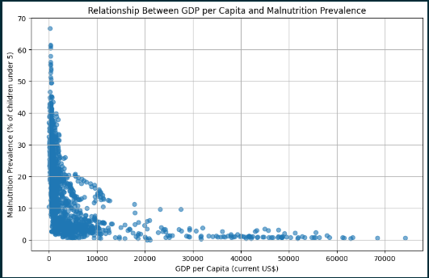
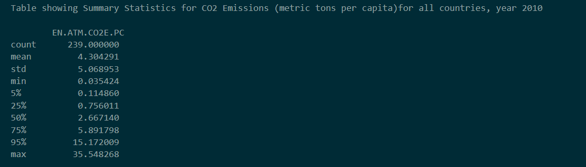
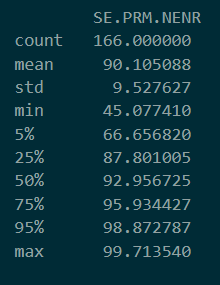
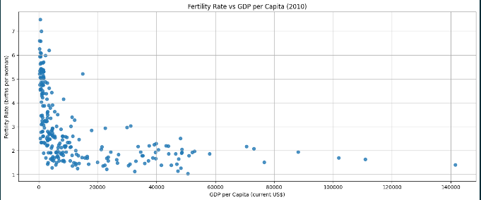
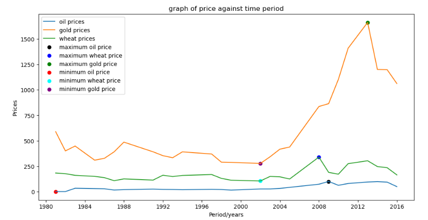
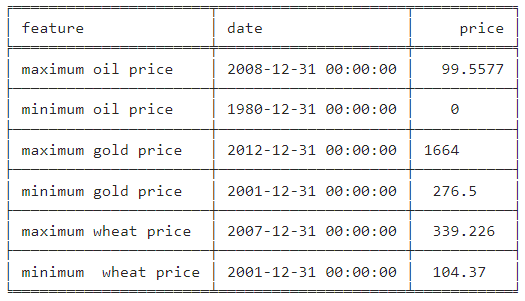
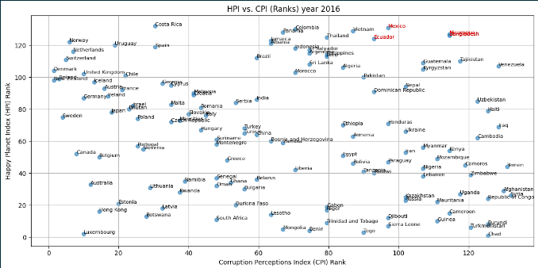

# global-data-analytics

This project consists of 3 The Project consist of three main core analytics tasks:

1. Malnutrition prevalence versus GDP per capita

Table showing Summary Statistics for CO2 Emissions (metric tons per capita)for all countries, year 2010:

Table showing Summary Statistics for Primary School Enrolment (% net) for all countries, year 2010:

Fertility Rate vs GDP per Capita (2010):

2. analysis of oil, wheat and gold price over time

Their all times highs and lows and their price dates:

4. Happy planet index versus corruption index:

You can finf the source code for all in the shared jupyter notebook above
